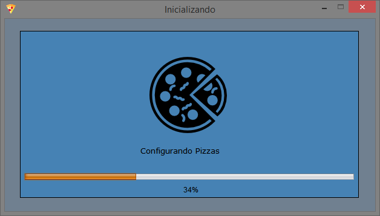
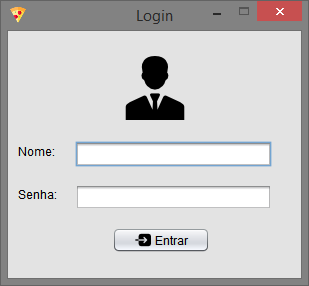
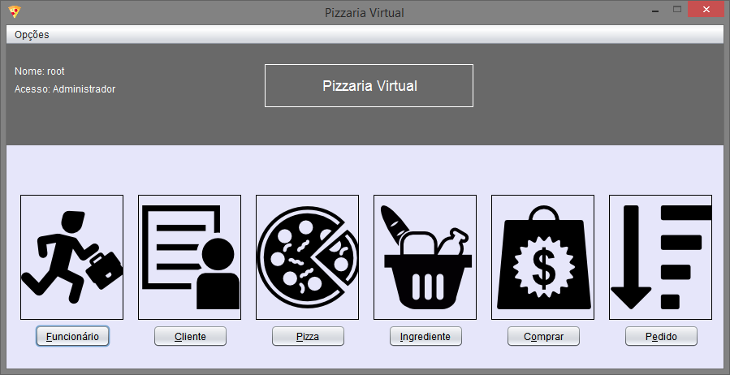
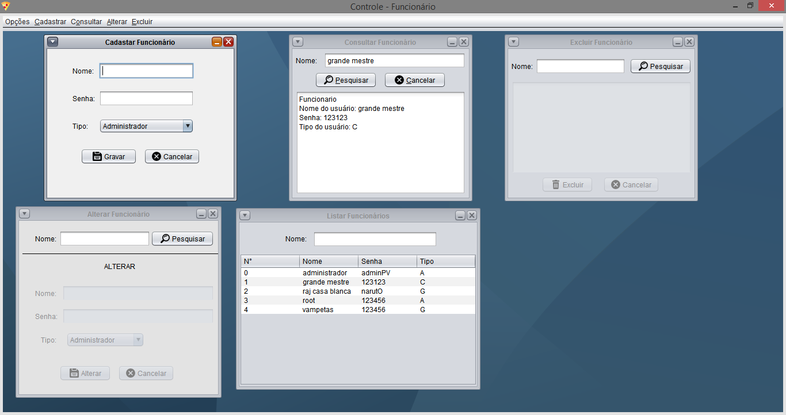
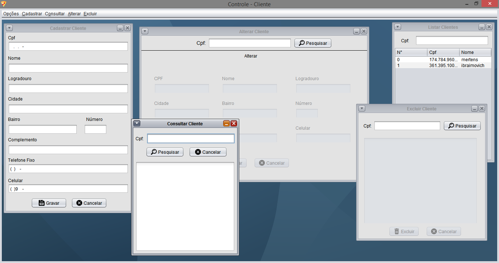
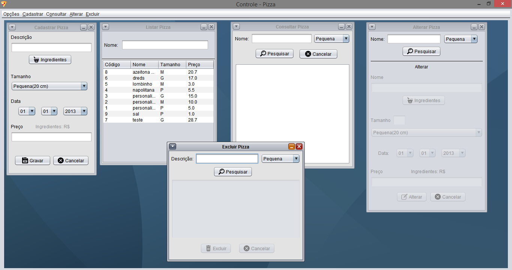
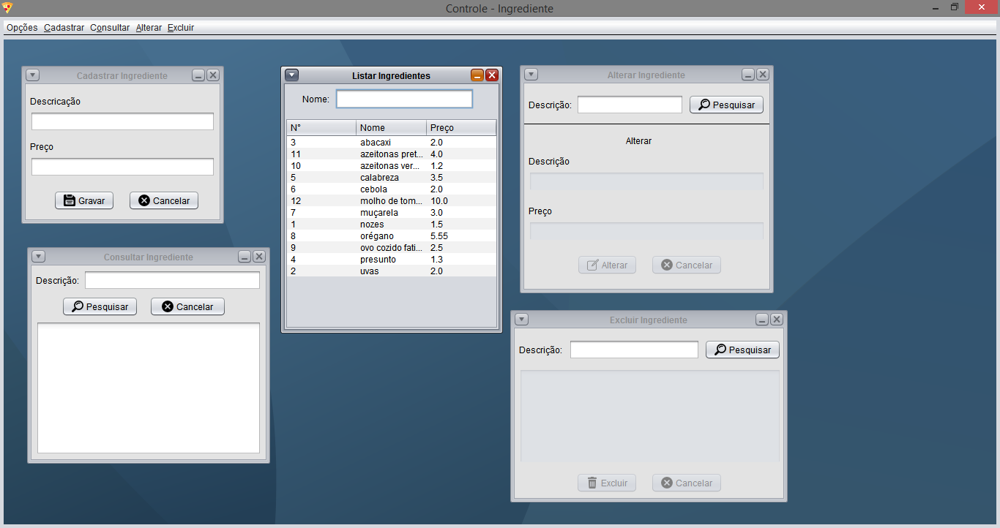
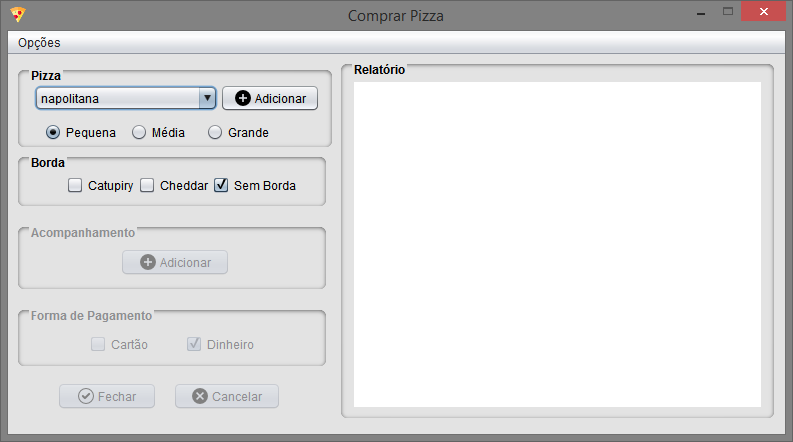
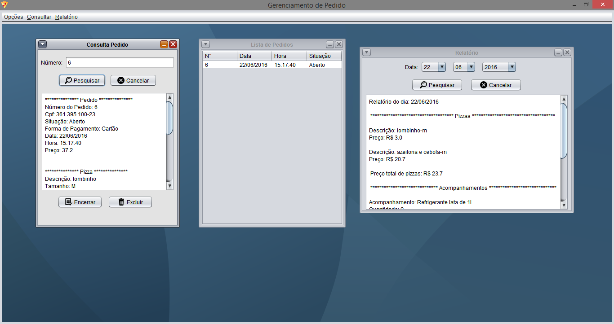

# Pizzaria-virtual
**Trabalho da disciplina Tecnologia orientada a obejtos:**Uma pizzaria precisa de um software para gerenciar os pedidos dos clientes. Este sistema, doravante denominado PV, deve possuir três módulos principais: Controle de Compras, Controle de Pedidos e Controle de Funcionários, que são descritos a seguir.

- Controle de Compras: este módulo é composto de serviços elementares para que os clientes da pizzaria possam, por exemplo, selecionar um tipo de pizza e uma forma de pagamento. Este módulo é composto por 4 submódulos: Clientes, Pizzas, Ingredientes e Compras. Os módulos Clientes e Compras possuem um grupo de funções específicas para atender as necessidades dos clientes (p. ex., montar uma pizza e selecionar um acompanhamento) e fornecer um conjunto de serviços necessários ao processo de compra e venda (p. ex., fechar o pedido enviando uma notificação para o funcionário responsável pelo controle dos pedidos). Os submódulos Pizzas e Ingredientes possuem, respectivamente, rotinas de manutenção das pizzas e dos seus ingredientes.

- Controle de Pedidos: responsável pelo registro, manutenção e atendimento do(s) pedido(s) de pizza(s) do(s) cliente(s). Assim que um cliente fecha o seu pedido ele é registrado e permanece pendente até que o mesmo possa ser processado. Este processamento inclui o recebimento da notificação de pedido pendente pelo funcionário, o envio de notificação para o pizzaiolo preparar a pizza e o envio da pizza para o endereço do cliente. Com o fim do processamento do pedido, o mesmo é registrado como pedido atendido.

- Controle de Funcionários: responde pela segurança do sistema. Somente funcionários cadastrados e autorizados podem usar as funções do PV. O Administrador é o funcionário responsável pelos serviços deste módulo. Cada funcionário cadastrado no sistema é associado a um perfil, que define os serviços que o funcionário pode realizar. A PV oferece uma política de atendimento aos seus clientes que funciona da seguinte maneira:

 * inicialmente faz-se a autenticação do login do usuário, se ele for um usuário novo é necessário efetuar o seu cadastro;

 * o usuário faz a escolha do tipo de pizza ou monta um tipo específico de pizza, segundo os ingredientes disponíveis no sistema;

 * seleciona um acompanhamento;

 * escolhe a forma de pagamento (dinheiro ou cartão de crédito);

 * o cliente confirma todos os dados do seu pedido para concluí-lo.
 
 
 **Inicialização do sistema:**

**Tela de Login:**

**Tela de Menu:**

**Controle de funcionários:**

**Controle de clientes:**

**Controle das pizzas:**

**Controle de Ingredientes:**

**Controle de Compras:**

**Controle de Pedidos:**

